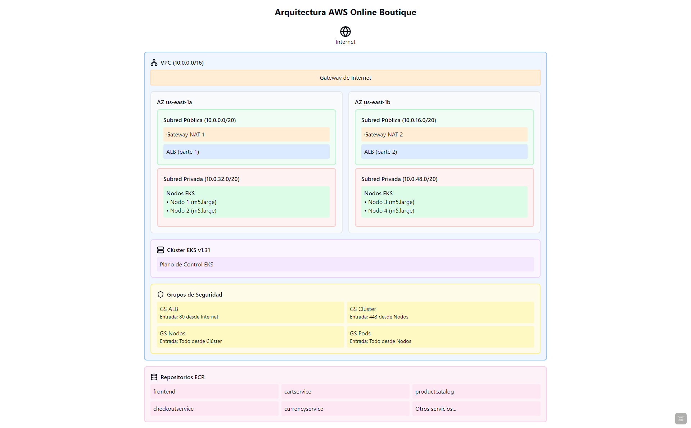

# Online Boutique Infrastructure Project

[En este repositorio](https://github.com/qmatiaslopez/obligatorio-online-boutique) se implementa la infraestructura necesaria para desplegar la aplicación Online Boutique de Google en AWS utilizando EKS (Elastic Kubernetes Service). Online Boutique es una aplicación de microservicios en la nube que cuenta con 11 servicios desarrollada por Google Cloud para demostrar el uso de tecnologías nativas de la nube.

## Arquitectura



## Requisitos Previos

El proyecto ha sido probado en Ubuntu 24.04 LTS. Se requieren las siguientes herramientas con sus versiones mínimas:

```bash
aws-cli v2.21.3
docker v24.0.7
terraform v1.9.8
kubectl v1.31.3
git v2.43.0
```

### Instalación de Dependencias en Ubuntu 24.04

```bash
# Instalar AWS CLI
sudo snap install aws-cli --classic

# Instalar kubectl
sudo snap install kubectl --classic

# Instalar Terraform
sudo snap install terraform --classic

# Instalar Docker
sudo apt update 
sudo apt install docker.io 
sudo usermod -aG docker ${USER}

# Instalar Git
sudo apt install git
```

### Obtener el Proyecto

Para obtener una copia del proyecto, ejecuta:

```bash
git clone https://github.com/qmatiaslopez/obligatorio-online-boutique.git
cd obligatorio-online-boutique
```

### Configuración del entorno

Es necesario tener configuradas las credenciales de AWS. Esto se puede hacer de dos formas:

1. Usando el comando aws configure:
```bash
aws configure
```

2. O configurando directamente el archivo ~/.aws/credentials

## Estructura del Proyecto

```
.
├── k8s/
│   ├── manifests/
│   │   └── all-services.yaml
│   └── scripts/
│       └── deploy.sh
├── terraform/
│   ├── modules/
│   │   ├── ecr/
│   │   ├── eks/
│   │   ├── lb/
│   │   ├── networking/
│   │   └── security/
│   ├── main.tf
│   ├── variables.tf
│   └── versions.tf
└── online-boutique/
    └── src/
        ├── adservice/
        ├── cartservice/
        ├── checkoutservice/
        └── ...
```

## Despliegue

### 1. Configuración de Terraform

1. Navega al directorio de Terraform:
```bash
cd terraform
```

2. Inicializa Terraform:
```bash
terraform init
```

3. Revisa el plan de Terraform:
```bash
terraform plan
```

4. Aplica la configuración:
```bash
terraform apply
```

### 2. Despliegue de la Aplicación

Una vez que la infraestructura esté lista, ejecuta el script de despliegue:

```bash
cd k8s/scripts
./deploy.sh
```

## Verificación del Despliegue

Para verificar que todo está funcionando correctamente:

1. Verifica los pods:
```bash
kubectl get pods -n online-boutique
```

2. Verifica los servicios:
```bash
kubectl get services -n online-boutique
```

3. Accede a la aplicación usando la URL proporcionada por el script de despliegue.

## Limpieza

Para eliminar todos los recursos creados:

1. Elimina los recursos de Kubernetes:
```bash
kubectl delete namespace online-boutique
```

2. Elimina la infraestructura de AWS:
```bash
cd terraform
terraform destroy
```

## Créditos

Este proyecto utiliza [Online Boutique](https://github.com/GoogleCloudPlatform/microservices-demo), una aplicación de demostración de microservicios desarrollada por Google Cloud Platform. La infraestructura ha sido adaptada para su despliegue en AWS utilizando EKS.